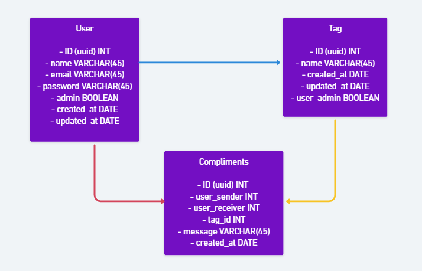
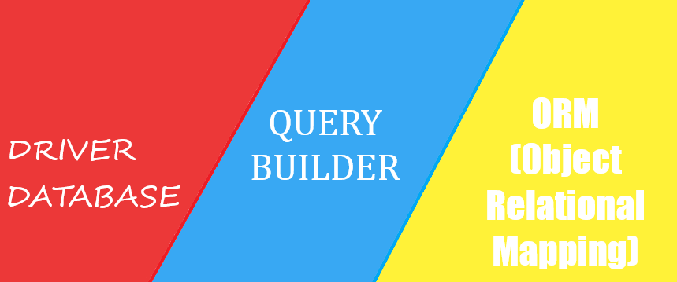
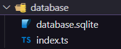
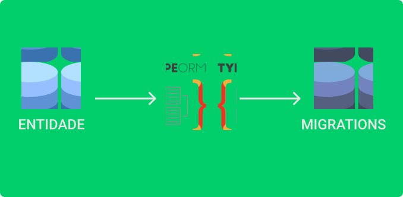

<h4
  align="center"
>
  
</h4>

<h3
  align="center"
>
  VALORIZA - Project created at
  <a
    href="https://nextlevelweek.com/pre-nlw"
  >
    NLW Together
  </a>
  , Special Edition
  <a
    href="https://rocketseat.com.br"
  >
    Rocketseat
  </a>
  bootcamp, the project is an API created with
  <a
    href="https://nodejs.org/en/"
  >
    Node.js
  </a>
  technology by instructor
  <a
    href="https://github.com/danileao"
  >
    Daniele Leão
  </a>
  .
</h3>

<br
/>

<h3
  align="center"
>
  <a
    href="#TECHNOLOGIES"
    style="text-decoration: none"
  >
    
  </a>&nbsp;&nbsp;&nbsp;
  <a
    href="#BUILDING-THE-PROJECT"
    style="text-decoration: none"
  >
    
  </a>&nbsp;&nbsp;&nbsp;
  <a
    href="#SCREENS"
    style="text-decoration: none"
  >
    
  </a>&nbsp;&nbsp;&nbsp;
  <a
    href="#LICENSE"
    style="text-decoration: none"
  >
    
  </a>&nbsp;&nbsp;&nbsp;
  <a
    href="#ABOUT-ME"
    style="text-decoration: none"
  >
    
  </a>
</h3>

<br
/>

### TECHNOLOGIES

<p
  align="center"
>
  Main technologies used in the construction of this application.
</p>

<br
/>
<h3
  align="center"
>
  <a
    href="https://nodejs.org/en/"
    style="text-decoration: none"
  >
    
  </a>
  <a
    href="https://yarnpkg.com"
    style="text-decoration: none"
  >
    
  </a>
  <a
    href="https://code.visualstudio.com"
    style="text-decoration: none"
  >
    
  </a>
  <a
    href="https://insomnia.rest"
    style="text-decoration: none"
  >
    
  </a>
  <a
    href="https://www.beekeeperstudio.io"
    style="text-decoration: none"
  >
    
  </a>
  <a
    href="https://expressjs.com/pt-br/"
    style="text-decoration: none"
  >
    
  </a>
  <a
    href="https://www.typescriptlang.org"
    style="text-decoration: none"
  >
    
  </a>
  <a
    href="https://typeorm.io/#/"
    style="text-decoration: none"
  >
    
  </a>
  <a
    href="https://www.sqlite.org/index.html"
    style="text-decoration: none"
  >
    
  </a>
</h3>

<br
/>

### BUILDING THE PROJECT

#### WHAT IS THE PROJECT?

<p
>
  The project consists of a praise platform, which we can praise and return praise from within the application.
</p>

<ul>
  <li>User Registration</li>
</ul>

<ul>
  <li>Tag Registration (possible compliments)</li>
  <ul>
    <li>Admin User Only</li>
  </ul>
</ul>

<ul>
  <li>Register of Compliments</li>
  <ul>
    <li>User ID</li>
    <li>Tag ID</li>
    <li>Creation Date</li>
  </ul>
</ul>

<ul>
  User Authentication
  <ul>
    <li>Generate JWT Token</li>
    <li>Validate user logged in required routes</li>
  </ul>
</ul>

<ul>
  <li>User List</li>
  <li>Tag Listing</li>
  <li>List of compliments by users</li>
</ul>

<br
/>

#### DEVELOPMENT ENVIRONMENT

<p
>
  The development environment setup for this application is
  <a
    href="https://www.notion.so/Configura-es-do-ambiente-45e12d2ced17465cabbd81dcbd53576d"
  >
    here
  </a>.
</p>

> [!NOTE]
> The environment setup page in [Notion](https://www.notion.so) was created by Rocketseat.

<h3>
  
</h3>

<br
/>

#### WHAT IS NODE.JS?

<p
>
  Node.js is a JavaScript runtime built on top of Chrome's
  <a
    href="https://v8.dev"
  >
    V8
  </a>
  JavaScript Engine and that allows the execution of
  <a
    href="https://developer.mozilla.org/pt-BR/docs/Web/JavaScript/Guide"
  >
    JavaScript
  </a>
  code outside of a web browser, the technology was created by
  <a
    href="https://github.com/ry"
  >
    Ryan Dahl
  </a>
  and its main characteristic and differential is the execution of requests/events in
  <a
    href="https://www.geeksforgeeks.org/why-node-js-is-a-single-threaded-language/"
  >
    single-thread
  </a>
  and the main advantage of use is the use of the same technology in the
  <a
    href="https://blog.rocketseat.com.br/tag/backend/"
  >
    backend
  </a>
  and in the
  <a
    href="https://blog.rocketseat.com.br/tag/reactjs/"
  >
    frontend
  </a>.
</p>
<h3
>
  
</h3>

<br
/>

#### WHAT IS AN API?

<p
>
  <a
    href="https://www.youtube.com/watch?v=ghTrp1x_1As"
  >
    APIs (Application Programming Interface)
  </a>
  are a set of patterns that are part of an interface and that allow the creation of platforms in a simpler and more practical way for developers. From APIs it is possible to create different software, applications, programs and platforms. For example, apps developed for
  <a
    href="https://www.android.com/intl/pt-BR_br/what-is-android/"
  >
    Android phones
  </a>
  and
  <a
    href="https://pt.wikipedia.org/wiki/IOS"
  >
    iPhone (iOS)
  </a>
  are created from defined standards and made available by the APIs of each
  <a
    href="https://en.wikipedia.org/wiki/Operating_system"
  >
    operating system
  </a>.
</p>

<h3
>
  
</h3>

<p
>
  The
  <a
    href="https://www.redhat.com/pt-br/topics/api/what-is-a-rest-api"
  >
    REST or RESTFul
  </a>
  standard that is defined as REST API, also called
  <a
    href="https://restfulapi.net"
  >
    RESTful API
  </a>
  , is an application programming interface (API or web API) that conforms to the restrictions of the
  <a
    href="https://en.wikipedia.org/wiki/Representational_state_transfer"
  >
    REST architecture
  </a>
  style, allowing interaction with web services RESTful. REST stands for representational transfer of state. This architecture was defined by computer scientist
  <a
    href="https://en.wikipedia.org/wiki/Roy_Fielding"
  >
    Roy Fielding
  </a>
  . REST is not a protocol or standard, but rather a set of architectural constraints. API developers can implement the REST architecture in a variety of ways. When a client makes a request using a RESTful API, that API transfers a representation of the resource's state to the requester or endpoint. This information (or representation) is delivered via <a
    href=""
  >
    HTTP
  </a>
  using one of several possible formats:
  <a
    href="https://developer.mozilla.org/pt-BR/docs/Learn/JavaScript/Objects/JSON"
  >
    Javascript Object Notation (JSON)
  </a>
  ,
  <a
    href="https://developer.mozilla.org/pt-BR/docs/Web/HTML"
  >
    HTML
  </a>
  , XLT, programming languages ​​or
  <a
    href="https://en.wikipedia.org/wiki/Plain_text"
  >
    plain text
  </a>
  . The JSON format is the most used programming language because, despite its name, it is independent of any other language and can be read by machines and humans.
</p>

<br
/>

#### WHY USE TYPESCRIPT?

<h3
>
  
</h3>
<p
>
  <a
    href="https://blog.geekhunter.com.br/introducao-a-typescript/"
  >
    Typescript
  </a>
    is an open source language developed by
  <a
    href="https://visualstudio.microsoft.com/pt-br/"
  >
    Microsoft
  </a>
  that is built on top of Javascript, which is very widespread these days. So this “superset” was created to add
  <a
    href="https://digitalinnovation.one/artigos/o-que-sao-tipagem-dinamica-estatica-fraca-e-forte"
  >
    static typing
  </a>
  capabilities to the original language.
</p>

<br
/>

#### MAIN TYPES OF METHODS IN A REST API

<br
/>

| Method | Description |
|---|---|
| GET | Search for information |
| POST | Insert (create) information |
| PUT | Change information |
| DELETE | Remove an information |
| PATCH | Change specific information |

<br
/>

#### CREATED THE FIRST ROUTE

<p
>
  To create the first route in <strong>typescript</strong>, we first need to start the application with <strong>yarn</strong>.
</p>

```powershell
$ yarn init -y
```

<br
/>

<p
>
  Then we need to install modules for our server, let's use <strong>typescript</strong> with development module.
</p>

```powershell
$ yarn add typescript -D
```

<br
/>

<p
>
  and <strong>express</strong> - a minimalist framework for building web servers.
</p>

```powershell
$ yarn add express
```

<br
/>

<p
>
  and the express type package as a development module.
</p>

```powershell
$ yarn add @types/express -D
```

<br
/>

<p
>
  Let's create a <strong>typescript</strong> file: index.ts
</p>

<h3
>
  
</h3>

<br
/>

<p
>
  In the first line we import the express, using the import.
</p>

```typescript
import express from 'express';
```

<br
/>

<p
>
  On the next line we need to initialize the express inside the app constant.
</p>

```typescript
const app = express();
```

<br
/>

<p
>
  Then we need to pass the <strong>app</strong> with the <strong>get</strong> method and pass the resource, which in this case is our route, as <strong>test</strong>, after an arrow function that have a request and a response as parameters.
</p>

| Command | Description |
|---|---|
| Request | Submit a data request |
| Response | Respond to a data request |

<br
/>

<p
>
  Inside the function, we pass the response with the <strong>send</strong> method, opening parentheses and quotation marks, we write a response message.
</p>

```typescript
app.get('/test', (request, response) => {
  response.send('Hi humans!');
})
```

<br
/>

<p
>
  On the next line we start the server with the <strong>app</strong> with the method <strong>listen</strong>, which will listen to our port, so we need to pass the port, which will be port <strong>3001</strong>.
</p>

```typescript
app.listen(3001, () => console.log('Hi humans!'));
```

<br
/>

<p
>
  Now we need to initialize the typescript
</p>

```powershell
$ yarn tsc
```
<br
/>

<p
>
  The typescript also needs a configuration file to work within the project.
</p>

```powershell
$ yarn tsc --init
```

<br
/>

<p
>
  We will also use a module to monitor the server called <a href="https://yarnpkg.com/package/ts-node-dev"> ts-node-dev </a>.
</p>

```powershell
yarn add ts-node-dev
```

<br
/>

<p
>
  Then we have to create a script inside the <strong>package.json</strong> file.
</p>

```json
  "scripts": {
    "dev": "ts-node-dev index.ts"
  },
```

<br
/>

<p
>
  To finally run our server locally:
</p>

```powershell
$ yarn dev
```

<br
/>

<p
>
  Now if everything is ok, we can access the url <http://localhost:3001/test>
</p>

<br
/>

#### SETTING INSOMNIA

<p
>
  For Insomnia configuration, I read an
  <a
    href="https://blog.cod3r.com.br/testes-de-api-rest-com-o-insomnia/"
  >
    article
  </a>
  that shows how to configure it, but I also recommend this
  <a
    href="https://www.youtube.com/watch?v=3tB0uDliS6Y"
  >
    video
  </a>
  from Rocketseat that shows you how to do it.
</p>

<br
/>

#### CREATING A POST ROUTE

<p
>
  We need to pass the
  <strong
  >
    app
  </strong>
  with the
  <strong
  >
    post
  </strong> method and pass the resource, <strong>testPost</strong>, after an arrow function. Inside the function, we pass the response with the <strong>send</strong> method, opening parentheses and quotation marks, we write a response message.
</p>

```typescript
app.post('/testPost', (request, response) => {
  response.send('Hi guys!');
})
```

<br
/>

#### DATABASE STRUCTURE

<p>
  Before continuing API development it is very important that we define the application <a href="https://www.ibm.com/docs/pt-br/mam/7.6.1?topic=design-relational-database-structure">database structure</a>.
</p>

<h3
>
  
</h3>

<p
>
  The image above is a non-accurate representation of what the <a href="https://www.visual-paradigm.com/guide/data-modeling/what-is-entity-relationship-diagram/">entity relationship diagram</a> would look like.
</p>

<br
/>

#### PARAMETER TYPES

<p
>
  <a
    href="https://blog.rocketseat.com.br/tipos-de-parametros-nas-requisicoes-rest/"
  >
    Types of Parameters
  </a>
  used in REST Requests:
</p>

| Parameter | Objective | Use case | Exemples |
|---|---|---|---|
| [Query Params](https://en.wikipedia.org/wiki/Query_string) | Receives the request data as a parameter in the URL. | Filters to query the application by url | <http://localhost:3001/produtos?name=teclado&description=tecladobom> |
| Route params | Receives the request data on the route. | Best way to search for something specific, delete or update using unique identifier. | GET:<http://localhost:3001/produtos/teclado> PUT:<http://localhost:3001/produtos/teclado> DELETE:<http://localhost:3001/produtos/teclado/718391938192>  |
| Body Params | Receives the request data in the request body, in a JSON object. |  Always using the POST method and sent in the request JSON format. | {  "product": "keyboard", "description": "good keyboard", "price": 250 } |

<br
/>

#### DATABASE: WHAT ARE THE WAYS TO USE IT IN THE APPLICATION?

<h3
>
  
</h3>
<p
>
  There are three ways to connect and use the database in the application with Node.js. Using the <a href="https://github.com/mysqljs/mysql">native database driver</a>, using a <a href="https://www.youtube.com/watch?v=U7GjS3FuSkA">query builder</a>, the most used in Node.js is the <a href="https://knexjs.org">Knex.js</a>, and using a <a href="https://www.youtube.com/watch?v=snOXxJa31GI">ORM</a> (Object-relational mapping), and the most used in Node.js are the <a href="https://sequelize.org/master/">Sequelize</a> and the <a href="https://typeorm.io/#/">TypeORM</a>.
  We use a **ORM**, specifically the **TypeORM**, for ease of database maintenance and direct conversion between a relational database and a language <a href ="https://www.youtube.com/watchv=QY0Kdg83orY">Object Oriented</a>.
</p>

<br
/>

#### CONFIGURING THE DATABASE IN OUR APPLICATION WITH TYPEORM

<p
>
  The first step to configure TypeORM in the application is to install the modules.

  Installing the TypeORM module
</p>

```powershell
$ yarn add typeorm
```

<br
/>

<p
>
  you also need to install <a href="https://github.com/rbuckton/reflect-metadata">reflect-metadata</a> to add metadata consistently in various use cases, such as objects as decorators.
</p>

```powershell
$ yarn add reflect-metadata
```

<br
/>

<p
>
  and import it into a global location in our API.
</p>

```typescript
$ import "reflect-metadata";
```

<br
/>

<p>
  the <a href="https://yarnpkg.com/package/@types/node">Node.js typing</a> package, and a database driver, in this case, we will use SQLite initially .
</p>

```powershell
$ yarn add sqlite3
```

<br
/>

<p
>
  Among the various options, to quickly create an initialization file within a project that is already in progress, you can run the command:
</p>

```powershell
$ typeorm init
```

<br
/>

<p
>
  It is still possible to use the same command with more options, to start a project.
</p>

```powershell
$ typeorm init --name projectName --database sqlite3
```

<br
/>

<p
>
  In this case, we will use a <strong>JSON</strong> file. To do this, let's create a <code>ormconfig.json</code> file in our project directory,
  in this project, so as not to risk changes in the project, let's create the file without using the command, and add whatever is necessary.
</p>

```json
{
  "type": "sqlite",
  "database": "src/database/database.sqlite"
}
```

<br
/>

<p>
  In the first line <strong>type</strong> we add the bank type. In the next one, <strong>database</strong>, we add the location of the database. For this database it is necessary to create an <code>index.ts</code>.
</p>

```typescript
import { createConnection } from "typeorm"

createConnection()
```

<br
/>

<p
>
  To create the database file we have to indicate it in an index file inside the database on the server and finally run the server.
</p>

```typescript
import './database';
```

<br
/>

<p>
  After that the SQLite database file is created.
</p>

<h3
>
  
</h3>

<br
/>

#### WHAT ARE MIGRATIONS?

<p
>
  <a href="https://cloud.google.com/architecture/database-migration-concepts-principles-part-1">Migrations</a> help
  database versioning
  during development, which
  usually avoid writing
  of SQL scripts and do how
  bank updates through
  of the programming language itself
  and frameworks used.
</p>

<h3
>
  
</h3>

<br
/>

#### SETTING THE MIGRATIONS

<p
>
First, we need to reference within the <strong>cli </strong> parameter, where our recognized migrations are stored.
</p>

```json
{
  "type": "sqlite",
  "database": "src/database/database.sqlite",
  "cli": {
  "migrationsDir": "src/database/migrations"
  }
}
```

<br
/>

<p
>
  Second, we need to create a script in <strong>package.json</strong> to run the <strong>TypeORM</strong> cli to create the <strong>migrations</strong>
</p>

```json
"scripts": {
  "typeorm": "ts-node-dev ./node_modules/typeorm/cli.js"
}
```

<br
/>

<p
>
  Then just create the first migration using the CLI.
</p>

```powershell
$  yarn typeorm migration:create -n CreateUsers
```

<p
>
This command will create a migration with a timestamp and table name which is <strong>CreateUsers</strong>. Within this query we will be able to create our tables for the database.
</p>

```typescript
import {
  MigrationInterface,
  QueryRunner,
  Table
} from "typeorm";

export class CreateUsers1631066606706 implements MigrationInterface {

  public async up(queryRunner: QueryRunner): Promise<void> {
    await queryRunner.createTable(
      new Table({
        name: "users",
        columns: [
          {
            name: "id",
            type: "uuid",
            isPrimary: true,
          },
          {
            name: "name",
            type: "varchar",
          },
          {
            name: "email",
            type: "varchar",
          },
          {
            name: "admin",
            type: "boolean",
            default: false,
          },
          {
            name: "created_at",
            type: "timestamp",
            default: "now()",
          },
          {
            name: "updated_at",
            type: "timestamp",
          }
        ]
      })
    )
  }

  public async down(queryRunner: QueryRunner): Promise<void> {
    await queryRunner.dropTable("users")
  }
}
```

<p
>
  In addition to <strong>MigrationInterface</strong>, and <strong>QueryRunner</strong>, used to run an SQL query, you need to import the <strong>Table</strong>, which will allow you to create a new SQL table inside a <strong>TypeScript</strong> (JavaScript) file inside an Up function to up a query or down to delete this query if it is not possible to create it. The ID type - <a href="https://www.uuidgenerator.net">UUID</a> is an acronym for <a href = "https://en.wikipedia.org/wiki/Universally_unique_identifier">universally unique identifier</a>, the term globally unique identifier is also widely used, but in general terms they are unique solidary pseudorandoms, for practical purposes what is generated is practically impossible to duplicate. The other column types are <a href="https://www.w3schools.com/sql/default.asp">basic data structure knowledge</a>.
</p>

<p>
  <code>VARCHAR</code> is a variable length string and can be a maximum of 8000 characters.

  <code>BOOLEAN</code> is a primitive data type that has two values, 0 or 1, false or true. Named boolean in honor of <a href="https://www.bbc.com/english/noticias/2015/11/151102_boole_google_tg"> George Boole </a>, who defined an algebraic logic system for the first time in half of the nineteenth century. It is used in logical operations such as <strong> conjunction </strong>, <strong> disjunction </strong>, <strong> exclusive disjunction </strong>, <strong> logical equivalence </strong> and <strong> negation </strong>, personal to some of the operations of <strong> Boolean algebra </strong>.

  <code>TIMESTAMP</code> is a string denoting the time or data that a certain event occurred and represents a specific point on the timeline and takes into account the time zone in question (UTC).
</p>

<p
>
  To run this migration we need to inform where migrations are located, within the <strong>migrations</strong> parameter.
</p>

```json
{
  "type": "sqlite",
  "database": "src/database/database.sqlite",
  "migrations": [ "src/database/migrations/*.ts" ],
  "cli": {
    "migrationsDir": "src/database/migrations"
  }
}
```

<p
>
  Then we just need to run this migration in the terminal and that's it, for that we need to run the command below and it will create our table in the database.
</p>

```powershell
$ yarn typeorm migration:run CreateUsers
```
<br
/>

#### WHAT IS ENTITY?

<p
>
  <a href="https://pt.wikipedia.org/wiki/Entity_(inform%C3%A1tica)">Entity</a> is a thing, concrete or abstract, including associations between them, abstracted from the real world and modeled in the form of a table that will store information in the database. Inside an ORM it works by receiving the application data in the <strong>Entity</strong>, passing the information through the ORM, which will transcribe this code into <strong>SQL</strong>, and transferring this information or change to the database.
</p>

<h3
>
  
</h3>

<br
/>

#### CREATE A NEW ENTITY

<p
>
  Para criarmos uma entidade com o TypeORM precisamos definir onde essa entidade está dentro da nossa aplicação, para isso dentro do <strong>ormconfig.json</strong>
</p>

```json
{
  "type": "sqlite",
  "database": "src/database/database.sqlite",
  "migrations": [ "src/database/migrations/*.ts" ],
  "cli": {
    "migrationsDir": "src/database/migrations",
    "entitiesDir": "src/entities"
  }
}
```

<p
>
  Agora precisamos rodar um comando na cli para criar a entidade dentro da pasta entities referenciada no <strong>ormconfig.json</strong>
</p>

```powershell
$ yarn typeorm entity:create -n User
```

<p
>
  Depois podemos ver o arquivo <strong>User.ts</strong> dentro da pasta <strong>entities</strong>, e ele já cria uma base do que vai ser a entidade de fato. Mas antes de continuar, devemos habilitar o <strong>experimentalDecorators</strong> e o <strong>emitDecoratorMetadata</strong>, para podermos trabalhar com <strong>decorators</strong>.
</p>

```json
{
  "experimentalDecorators": true,
  "emitDecoratorMetadata": true
}
```

```typescript
import { Entity } from "typeorm";

@Entity()
export class User {

};
```

<p>
  No decorator Entity precisamos passar como parametro o nome da entidade, dentro da classe <strong>User</strong> temos que definir todos os atributos já setados na migration <strong>CreateUsers</strong>, também precisamos definir suas colunas, id, como <strong>PrimaryColumn</strong>, as colunas de tipo string, number, e boolean, são definidas apenas como <strong>Column</strong>, já as colunas de data, precisão de um tipo especial, a coluna de criação de data é definida como <strong>CreateDateColumn</strong>, a coluna de alteração de data é definida como <strong>UpdateDateColumn<strong>.
</p>

```typescript
import {
  Entity,
  PrimaryColumn,
  Column,
  CreateDateColumn,
  UpdateDateColumn
} from "typeorm";

@Entity("users")
export class User {
  @PrimaryColumn()
  id: string;

  @Column()
  name: string;

  @Column()
  email: string;

  @Column()
  admin: boolean;

  @CreateDateColumn()
  created_at: Date;

  @UpdateDateColumn()
  updated_at: Date;
};
```

<p>
  Por último, precisamos configurar a biblioteca <strong>UUID</strong> dentro da entidade, para o mesmo, precisamos baixa-lá
</p>

```powershell
$ yarn add uuid
```

<p>
  E também sua biblioteca de tipos.
</p>

```powershell
$ yarn add @types/uuid
```

<p>
  Agora é preciso importar esse módulo dentro da <strong>Entidade</strong>
</p>

```typescript
import { v4 as uuid } from 'uuid';
```

<p>
  Precisamos também definir a coluna id como <strong>readonly</strong>, para no caso de um possível update desse usuário, ele não poderá ser alterado, e só poderá ser definido dentro dessa entidade.
</p>

```typescript
  @PrimaryColumn()
  readonly id: string
```

<p>
  Finalizando a entidade, para esse <strong>ID</strong>, precisamos criar um construtor com uma instrução, caso ele venha com um valor nulo, defini-lo como <strong>UUID</strong>.
</p>

```typescript
  constructor() {
    if(!this.id) {
      this.id = uuid();
    }
  }
```

<br
/>

#### WHAT IS REPOSITORY?


<br
/>

#### CREATE A NEW REPOSITORY

<br
/>

#### WHAT IS SERVICE?

<br
/>

#### CREATE A NEW SERVICE

<br
/>

#### WHAT IS CONTROLLER?

<br
/>

#### CREATE A NEW CONTROLLER

<br
/>

#### STARTING THE PROJECT ON YOUR MACHINE

<p
>
  I'll leave a script on how to clone and run the app in development
</p>

<p
>
  Clone this repository
</p>

```powershell
$ git clone https://github.com/franciscoarmando63/valoriza.git
```

<br
/>

<p
>
  Access the project folder in terminal/cmd or powerhell
</p>

```powershell
$ cd valoriza
```

<br
/>

<p
>
  Install dependencies
</p>

```powershell
$ yarn install .
```

<br
/>

<p
>
  Run the application in development mode with <strong>ts-node-dev</strong>.
</p>

```powershell
$ yarn dev
```

<br
/>

<p
>
  The server will start on port: 3001 - go to <http://localhost:3001/>
</p>

<br
/>

### SCREENS

<br
/>

### LICENSE

<br
/>

### ABOUT ME

<br
/>