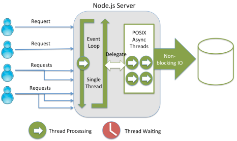
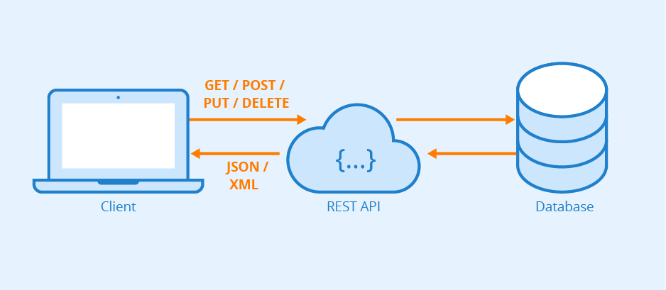
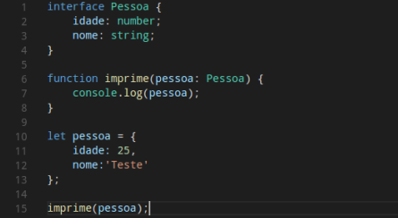
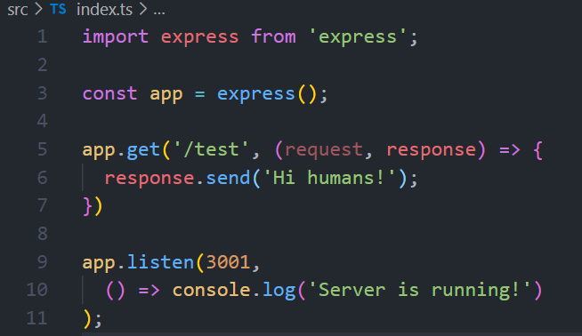

<h3
  align="center"
>
  
</h3>

<h3
  align="center"
>
  VALORIZA - Project created at
  <a
    href="https://nextlevelweek.com/pre-nlw"
  >
    NLW Together
  </a>
  , Special Edition
  <a
    href="https://rocketseat.com.br"
  >
    Rocketseat
  </a>
  bootcamp, the project is an API created with
  <a
    href="https://nodejs.org/en/"
  >
    Node.js
  </a>
  technology by instructor
  <a
    href="https://github.com/danileao"
  >
    Daniele Leão
  </a>
  .
</h3>

<br
/>

<h3
  align="center"
>
  <a
    href="#TECHNOLOGIES"
    style="text-decoration: none"
  >
    
  </a>&nbsp;&nbsp;&nbsp;
  <a
    href="#BUILDING-THE-PROJECT"
    style="text-decoration: none"
  >
    
  </a>&nbsp;&nbsp;&nbsp;
  <a
    href="#SCREENS"
    style="text-decoration: none"
  >
    
  </a>&nbsp;&nbsp;&nbsp;
  <a
    href="#LICENSE"
    style="text-decoration: none"
  >
    
  </a>&nbsp;&nbsp;&nbsp;
  <a
    href="#ABOUT-ME"
    style="text-decoration: none"
  >
    
  </a>
</h3>

<br
/>

### TECHNOLOGIES

<p
  align="center"
>
  Main technologies used in the construction of this application.
</p>

<br
/>
<h3
  align="center"
>
  <a
    href="https://nodejs.org/en/"
    style="text-decoration: none"
  >
    
  </a>
  <a
    href="https://yarnpkg.com"
    style="text-decoration: none"
  >
    
  </a>
  <a
    href="https://code.visualstudio.com"
    style="text-decoration: none"
  >
    
  </a>
  <a
    href="https://insomnia.rest"
    style="text-decoration: none"
  >
    
  </a>
  <a
    href="https://www.beekeeperstudio.io"
    style="text-decoration: none"
  >
    
  </a>
  <a
    href="https://expressjs.com/pt-br/"
    style="text-decoration: none"
  >
    
  </a>
  <a
    href="https://www.typescriptlang.org"
    style="text-decoration: none"
  >
    
  </a>
  <a
    href="https://typeorm.io/#/"
    style="text-decoration: none"
  >
    
  </a>
  <a
    href="https://www.sqlite.org/index.html"
    style="text-decoration: none"
  >
    
  </a>
</h3>

<br
/>

### BUILDING THE PROJECT

#### PROJECT'S GOAL

<p
>
 O projeto tem o objetivo de enviar elogios e receber elogios dentro para os cadastrados na aplicação.
</p>

<br
/>

#### DEVELOPMENT ENVIRONMENT

<p
>
  The development environment setup for this application is
  <a
    href="https://www.notion.so/Configura-es-do-ambiente-45e12d2ced17465cabbd81dcbd53576d"
  >
    here
  </a>. (The environment setup page in
  <a
    href="https://www.notion.so/pt-br"
  >
    Notion
  </a> was created by Rocketseat).
</p>

<br
/>

#### WHAT IS NODE.JS?

<p
>
  Node.js is a JavaScript runtime built on top of Chrome's
  <a
    href="https://v8.dev"
  >
    V8
  </a>
  JavaScript Engine and that allows the execution of
  <a
    href="https://developer.mozilla.org/pt-BR/docs/Web/JavaScript/Guide"
  >
    JavaScript
  </a>
  code outside of a web browser, the technology was created by
  <a
    href="https://github.com/ry"
  >
    Ryan Dahl
  </a>
  and its main characteristic and differential is the execution of requests/events in
  <a
    href="https://www.geeksforgeeks.org/why-node-js-is-a-single-threaded-language/"
  >
    single-thread
  </a>
  and the main advantage of use is the use of the same technology in the
  <a
    href="https://blog.rocketseat.com.br/tag/backend/"
  >
    backend
  </a>
  and in the
  <a
    href="https://blog.rocketseat.com.br/tag/reactjs/"
  >
    frontend
  </a>.
</p>
<h3
>
  
</h3>

<br
/>

#### WHAT IS AN API?

<p
>
  <a
    href="https://www.youtube.com/watch?v=ghTrp1x_1As"
  >
    APIs (Application Programming Interface)
  </a>
  are a set of patterns that are part of an interface and that allow the creation of platforms in a simpler and more practical way for developers. From APIs it is possible to create different software, applications, programs and platforms. For example, apps developed for
  <a
    href="https://www.android.com/intl/pt-BR_br/what-is-android/"
  >
    Android phones
  </a>
  and
  <a
    href="https://pt.wikipedia.org/wiki/IOS"
  >
    iPhone (iOS)
  </a>
  are created from defined standards and made available by the APIs of each
  <a
    href="https://en.wikipedia.org/wiki/Operating_system"
  >
    operating system
  </a>.
</p>

<h3
>
  
</h3>

<p
>
  The
  <a
    href="https://www.redhat.com/pt-br/topics/api/what-is-a-rest-api"
  >
    REST or RESTFul
  </a>
  standard that is defined as REST API, also called
  <a
    href="https://restfulapi.net"
  >
    RESTful API
  </a>
  , is an application programming interface (API or web API) that conforms to the restrictions of the
  <a
    href="https://en.wikipedia.org/wiki/Representational_state_transfer"
  >
    REST architecture
  </a>
  style, allowing interaction with web services RESTful. REST stands for representational transfer of state. This architecture was defined by computer scientist
  <a
    href="https://en.wikipedia.org/wiki/Roy_Fielding"
  >
    Roy Fielding
  </a>
  . REST is not a protocol or standard, but rather a set of architectural constraints. API developers can implement the REST architecture in a variety of ways. When a client makes a request using a RESTful API, that API transfers a representation of the resource's state to the requester or endpoint. This information (or representation) is delivered via <a
    href=""
  >
    HTTP
  </a>
  using one of several possible formats:
  <a
    href="https://developer.mozilla.org/pt-BR/docs/Learn/JavaScript/Objects/JSON"
  >
    Javascript Object Notation (JSON)
  </a>
  ,
  <a
    href="https://developer.mozilla.org/pt-BR/docs/Web/HTML"
  >
    HTML
  </a>
  , XLT, programming languages ​​or
  <a
    href="https://en.wikipedia.org/wiki/Plain_text"
  >
    plain text
  </a>
  . The JSON format is the most used programming language because, despite its name, it is independent of any other language and can be read by machines and humans.
</p>

<br
/>

#### WHY USE TYPESCRIPT?

<h3
>
  
</h3>
<p
>
  <a
    href="https://blog.geekhunter.com.br/introducao-a-typescript/"
  >
    Typescript
  </a>
    is an open source language developed by
  <a
    href="https://visualstudio.microsoft.com/pt-br/"
  >
    Microsoft
  </a>
  that is built on top of Javascript, which is very widespread these days. So this “superset” was created to add
  <a
    href="https://digitalinnovation.one/artigos/o-que-sao-tipagem-dinamica-estatica-fraca-e-forte"
  >
    static typing
  </a>
  capabilities to the original language.
</p>

<br
/>

#### MAIN TYPES OF METHODS IN A REST API

<br
/>

| Method | Description |
|---|---|
| GET | Search for information |
| POST | Insert (create) information |
| PUT | Change information |
| DELETE | Remove an information |
| PATCH | Change specific information |

<br
/>

#### CREATED THE FIRST ROUTE

<p
>
  To create the first route in <strong>typescript</strong>, we first need to start the application with <strong>yarn</strong>.
</p>

```powershell
$ yarn init -y
```

<br
/>

<p
>
  Then we need to install modules for our server, let's use <strong>typescript</strong> with development module.
</p>

```powershell
$ yarn add typescript -D
```

<br
/>

<p
>
  and <strong>express</strong> - a minimalist framework for building web servers.
</p>

```powershell
$ yarn add express
```

<br
/>

<p
>
  and the express type package as a development module.
</p>

```powershell
$ yarn add @types/express -D
```

<br
/>

<p
>
  Let's create a <strong>typescript</strong> file: index.ts
</p>

<h3
>
  
</h3>

<br
/>

<p
>
  In the first line we import the express, using the import.
</p>

```typescript
import express from 'express';
```

<br
/>

<p
>
  On the next line we need to initialize the express inside the app constant.
</p>

```typescript
const app = express();
```

<br
/>

<p
>
  Then we need to pass the <strong>app</strong> with the <strong>get</strong> method and pass the resource, which in this case is our route, as <strong>test</strong>, after an arrow function that have a request and a response as parameters.
</p>

| Command | Description |
|---|---|
| Request | Submit a data request |
| Response | Respond to a data request |

<br
/>

<p
>
  Inside the function, we pass the response with the <strong>send</strong> method, opening parentheses and quotation marks, we write a response message.
</p>

```typescript
app.get('/test', (request, response) => {
  response.send('Hi humans!');
})
```

<br
/>

<p
>
  On the next line we start the server with the <strong>app</strong> with the method <strong>listen</strong>, which will listen to our port, so we need to pass the port, which will be port <strong>3001</ strong>.
</p>

```typescript
app.listen(3001, () => console.log('Hi humans!'));
```

<br
/>

<p
>
  Now we need to initialize the typescript
</p>

```powershell
$ yarn tsc
```
<br
/>

<p
>
  The typescript also needs a configuration file to work within the project.
</p>

```powershell
$ yarn tsc --init
```

<br
/>

<p
>
  We will also use a module to monitor the server called <a href="https://yarnpkg.com/package/ts-node-dev"> ts-node-dev </a>.
</p>

```powershell
yarn add ts-node-dev
```

<br
/>

<p
>
  Then we have to create a script inside the <strong>package.json</strong> file.
</p>

```json
  "scripts": {
    "dev": "ts-node-dev index.ts"
  },
```

<br
/>

<p
>
  To finally run our server locally:
</p>

```powershell
$ yarn dev
```

<br
/>

#### Now if everything is ok, we can access the url <http://localhost:3001/test>

<br
/>

#### SETTING INSOMNIA

<p
>
  For Insomnia configuration, I read an <a href="https://blog.cod3r.com.br/testes-de-api-rest-com-o-insomnia/">article</a> that shows how to configure it, but I also recommend this <a href="https://www.youtube.com/watch?v=3tB0uDliS6Y">video</a> from Rocketseat that shows you how to do it.
</p>

<br
/>

#### CREATING A POST ROUTE

<p
>
  We need to pass the <strong>app</strong> with the <strong>post</strong> method and pass the resource, <strong>testPost</strong>, after an arrow function. Inside the function, we pass the response with the <strong>send</strong> method, opening parentheses and quotation marks, we write a response message.
</p>

```typescript
app.post('/testPost', (request, response) => {
  response.send('Hi guys!');
})
```

<br
/>

#### STARTING THE PROJECT ON YOUR MACHINE

<p
>
  I'll leave a script on how to clone and run the app in development
</p>

<p
>
  Clone this repository
</p>

```powershell
$ git clone https://github.com/franciscoarmando63/valoriza.git
```

<br
/>

<p
>
  Access the project folder in terminal/cmd or powerhell
</p>

```powershell
$ cd valoriza
```

<br
/>

<p
>
  Install dependencies
</p>

```powershell
$ yarn install .
```

<br
/>

<p
>
  Run the application in development mode with <strong>ts-node-dev</strong>.
</p>

```powershell
$ yarn dev
```

<br
/>

#### The server will start on port: 3001 - go to <http://localhost:3001/>

<br
/>

### SCREENS

<br
/>

### LICENSE

<br
/>

### ABOUT ME
