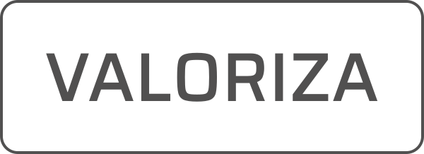

<h3
  align="center"
>
  
</h3>

<h3
  align="center"
>
  VALORIZA - Project created at <a href="https://nextlevelweek.com/pre-nlw">NLW Together</a>, Special Edition, <a href="https://rocketseat.com.br">Rocketseat</a> bootcamp, the project is an API created with <a href="https://nodejs.org/en/">Node.js</a> technology by instructor <a href="https://github.com/danileao">Daniele Leão</a>.
</h3>

 

<h3
  align="center"
>
  <a
    href="#building-the-project"
  >
    Building the project
  </a>&nbsp;&nbsp;&nbsp;
  <a
    href="#screens"
  >
    Screens
  </a>&nbsp;&nbsp;&nbsp;
  <a
    href="#Technologies"
  >
    Technologies
  </a>&nbsp;&nbsp;&nbsp;
  <a
    href="#LICENSE"
  >
    LICENSE
  </a>&nbsp;&nbsp;&nbsp;
  <a
    href="#About me"
  >
    About me
  </a>
</h3>

 

### Building the project

 

#### Development Environment

The development environment setup for this application is <a href="https://www.notion.so/Configura-es-do-ambiente-45e12d2ced17465cabbd81dcbd53576d">here</a>. (The environment setup page in <a href="https://www.notion.so/pt-br">Notion</a> was created by Rocketseat).

### Screens

### Technologies

### LICENSE

### About me
